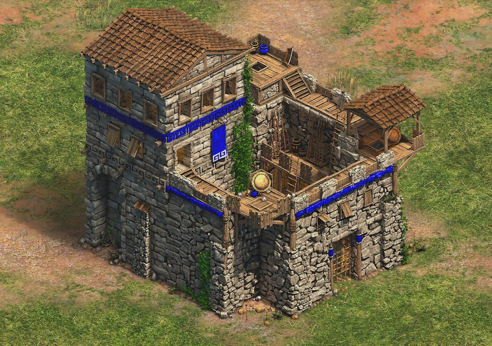
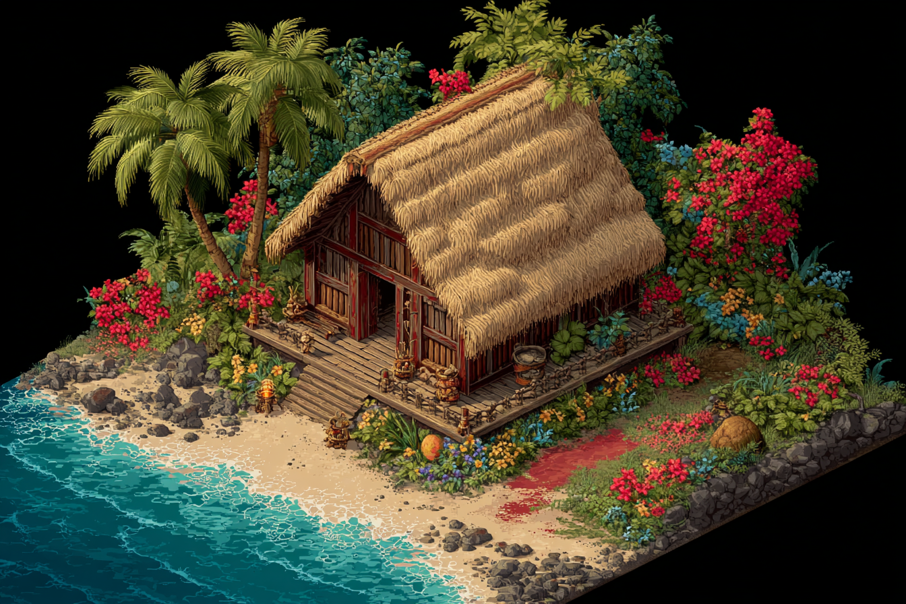

## Overview

Age of Empires II shipped in 1999 and still looks readable today. That's not nostalgia — it's discipline. The team was painting tiny isometric tiles that had to communicate "this is a Frankish knight on a stone road next to a market" at a single glance, often when the player was zoomed out and watching twelve other things at once. The art direction is a masterclass in legibility under constraint.

## Civilization sets

Each of the original thirteen civilizations got its own architecture set, but the game only used four visual families: West European, East European, Middle Eastern, and East Asian. That's an interesting compromise. Authentic-per-civ would have been impossible to render at the time and would have hurt readability — the player has to recognize "that's an enemy castle" in a quarter-second. Four families, with palette and silhouette as the differentiators, was enough to feel diverse without becoming visual noise.

The Definitive Edition added more sets and reskinned the originals. Worth comparing side by side:

- The original Western European keep silhouette is squatter and heavier than the DE version.
- DE pushed contrast and saturation, which reads better on modern displays but loses some of the painterly feel.
- A new Hawaiian style would need broad, readable forms: open-air hale structures, sweeping low roofs, lava-rock foundations, and rich botanical silhouettes. It should favor immediate island identity over literal detail, giving the player a quick visual cue of a coastal culture with a different architectural rhythm.

## Color and ownership

Every unit and building takes on the player's team color through a small palette swap. This is the single most important readability decision in the game. You don't read units by their armor or by their face — you read them by the colored cloth on their tunic and the colored flag on their building. The actual unit art is monochromatic-ish, painted to leave room for the team-color overlay to do the heavy lifting.

This is why screenshots from professional matches are still legible on a 1080p stream twenty-five years later.

## Animation

Sprites were hand-rotated through 8 facing directions and animated frame-by-frame. Watch a Trebuchet fire — the wind-up, release, and recoil are individually keyframed. There's no skeletal animation, no in-between math, just a painter making decisions about which pose communicates the action most clearly.

The trade-off: every new unit is a massive amount of work. The benefit: every pose is intentional. Compare to modern engines where animation rigs sometimes produce shapes the original concept artist never approved.

## What I take from it

- Constraints make legibility decisions for you. Limited palettes, limited sets, limited frames — the team had to choose what mattered.
- Silhouette before detail. If you can't read the unit's role at thumbnail size, no amount of texture work will save it.
- Color is identity. Owning the team-color slot in your palette is worth more than any other rendering choice.

A great pixel-art game ages better than most 2010-era 3D games. Worth studying the reasons.
